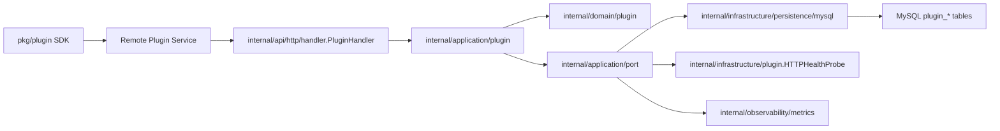

# 远端插件系统设计

本文档描述 Keiyaku-Go 远端服务插件系统的架构、边界、数据模型、网关规则和生产运行约束。设计裁决来源是 [ADR 20260519：采用远端服务插件系统](../adr/20260519-adopt-remote-service-plugin-system.md)。

## 设计目标

- 插件作为独立服务部署在独立服务器，不加载进主服务进程。
- 主服务统一提供注册、心跳、健康检查、审计、路由解析、鉴权上下文和 HTTP 网关。
- 当前版本实际支持 HTTP 插件协议；代码保留 `protocol` 扩展点，非 HTTP 注册直接拒绝。
- 插件注册表持久化到 MySQL，主服务重启后仍可查询插件状态。
- 保持 Clean Architecture 分层和手动装配，不引入运行时反射型 DI 容器。

## 非目标

- 不支持 Go dynamic plugin。
- 不提供第三方不可信插件市场、代码沙箱或插件权限隔离运行时。
- 当前版本不支持 gRPC、WebSocket、SSE、事件订阅和异步消息插件。
- 当前版本不做同一 `plugin_key` 下的多版本灰度路由。
- 当前版本不升级到 per-plugin secret；注册仍使用主服务静态 Bearer token。

## 核心对象

| 对象 | 表 | 职责 |
| --- | --- | --- |
| 插件服务 | `plugin_services` | 插件身份、名称、协议、当前 manifest hash、管理状态 |
| 插件实例 | `plugin_instances` | 某台插件服务器的运行实例、base URL、版本、心跳租约、健康状态 |
| 插件路由 | `plugin_routes` | 主服务扩展路径到插件 upstream 路径的映射 |
| 审计事件 | `plugin_audit_events` | 注册、心跳、注销、健康变化、管理操作和网关失败摘要 |

同一 `plugin_key` 当前只允许一个 active manifest hash。新 manifest 注册成功后，主服务原子替换该插件的路由，并把旧 hash 实例标记为不兼容或不可路由。

## 模块边界



- `pkg/plugin` 只承载插件侧 SDK 和 manifest 类型，不得 import `internal`。
- `internal/domain/plugin` 承载状态、路由匹配、健康状态、审计事件和值对象。
- `internal/application/plugin` 承载注册、心跳、注销、管理操作、健康状态转换、路由缓存和安全校验。
- `internal/api/http` 承载 Gin DTO、注册 Handler、管理 Handler 和 HTTP 网关。
- `internal/infrastructure/persistence/mysql` 承载 GORM Model 与 Repository 实现。
- `internal/infrastructure/plugin` 承载 HTTP 健康探测适配器。
- `internal/bootstrap` 显式装配插件依赖和后台健康检查循环。

## 注册与路由

注册入口使用静态 Bearer token。token 只能证明调用方具备注册权限，插件身份还必须通过 `plugins.allowed_plugin_keys` 白名单约束。

插件实例通过 `POST /api/v1/plugins/{plugin_key}/instances/{instance_id}/heartbeat` 刷新租约。主服务保存 `last_seen_at` 和 `lease_expires_at`，注销接口只禁用实例，不删除历史服务记录。

网关入口是：

```text
/api/v1/extensions/{plugin_key}/*path
```

路由匹配顺序：

1. `plugin_key`
2. active route
3. HTTP method 精确匹配优先于 `ANY`
4. `exact` 优先于 `prefix`
5. 最长 path 优先

`prefix` 必须按路径段匹配，`/foo` 不匹配 `/foobar`。路由只允许挂在 `/api/v1/extensions/{plugin_key}` 下，插件不能覆盖主服务内置路径。

## 可路由条件

网关只选择满足以下条件的实例：

- 插件服务 `status=active`。
- 实例 `status=active`。
- 实例 `manifest_hash` 与服务 `current_manifest_hash` 一致。
- 实例 `lease_expires_at >= now`。
- 实例 `health_status` 为 `healthy` 或 `unknown`。

`unknown` 默认可路由，避免升级 v1.1 后尚未被健康检查探测的实例被立即摘除。连续健康检查失败达到 `plugins.unhealthy_threshold` 后，实例标记为 `unhealthy` 并从网关选择集中摘除；恢复成功后标记为 `healthy`。

## 健康检查

主服务后台任务按 `plugins.health_check_interval` 扫描 active 服务下的 active 实例，并请求：

```text
{base_url}{health_path}
```

健康检查规则：

- 使用 GET 请求。
- 单次探测超时由 `plugins.health_check_timeout` 控制。
- HTTP `2xx` 或 `3xx` 视为健康。
- 其他状态码或连接失败记为一次失败。
- 连续失败未达阈值时保留原健康状态并记录失败次数。
- 达到阈值后标记 `unhealthy`。
- 任意一次成功将失败次数清零并标记 `healthy`。

健康状态变化会写入审计事件、记录 metrics port，并主动失效该 `plugin_key` 的路由缓存。

## 路由缓存

应用层维护进程内路由缓存，缓存 active service、routes 和 routable instances，默认 TTL 为 `plugins.route_cache_ttl`。

缓存规则：

- miss 或过期时回源 MySQL。
- 注册、心跳、注销、服务启用/禁用、实例禁用和健康状态变化后主动失效对应 `plugin_key`。
- 缓存命中后仍会按当前时间重新过滤租约和健康状态，避免过期租约继续被选择。
- `plugins.route_cache_ttl: 0s` 可关闭路由缓存，回到 MySQL 实时解析。

当前 round-robin 状态仍为单进程内存状态，不跨主服务实例共享。

## 管理 API

管理接口默认走 JWT + Casbin：

| Method | Path | 说明 |
| --- | --- | --- |
| `GET` | `/api/v1/plugins` | 查询插件服务列表 |
| `GET` | `/api/v1/plugins/{plugin_key}` | 查询插件服务、实例和路由详情 |
| `GET` | `/api/v1/plugins/{plugin_key}/instances` | 查询插件实例状态 |
| `POST` | `/api/v1/plugins/{plugin_key}/disable` | 禁用插件服务 |
| `POST` | `/api/v1/plugins/{plugin_key}/enable` | 启用插件服务 |
| `POST` | `/api/v1/plugins/{plugin_key}/instances/{instance_id}/disable` | 禁用插件实例 |
| `GET` | `/api/v1/plugins/{plugin_key}/audit-events` | 查询插件审计事件 |

建议 Casbin 策略保留或覆盖：

```text
p, admin, /api/v1/plugins*, (GET|POST|DELETE)
```

当前默认 `configs/rbac/policy.csv` 的 admin 通配策略已经覆盖插件管理接口。

## 鉴权策略

| `auth_policy` | 行为 |
| --- | --- |
| `inherit` | 默认等同已认证用户 |
| `authenticated` | 必须携带有效用户 JWT |
| `rbac` | 使用真实请求路径与 method 走 Casbin 校验 |
| `admin` | 用户角色必须包含 `admin` |
| `public` | 仅当 `plugins.allow_public_routes=true` 时允许匿名访问 |

网关默认不透传原始 `Authorization`。只有 route 显式 `forward_auth_header=true` 时才透传。

## 请求转发

主服务转发以下上下文：

- `X-Trace-ID`
- `X-Keiyaku-Plugin-Key`
- `X-Keiyaku-User-ID`
- `X-Keiyaku-Username`
- `X-Keiyaku-User-Roles`
- `X-Forwarded-Host`
- `X-Forwarded-Proto`
- `X-Forwarded-Method`

主服务会移除 hop-by-hop headers、`Cookie`，默认移除 `Authorization`。

如果配置了 `plugins.gateway_signing_secret`，主服务会追加：

- `X-Keiyaku-Timestamp`
- `X-Keiyaku-Signature`

插件服务可用相同 secret 验证请求确实来自主服务。

## 审计与观测

审计事件记录运维摘要，不作为安全不可抵赖日志。事件类型包括：

- `register`
- `heartbeat`
- `unregister`
- `health_change`
- `admin_disable`
- `admin_enable`
- `route_replace`
- `gateway_failure`

审计 payload 只允许保存摘要字段，不保存 token、Authorization、Cookie、请求体或完整响应体。

网关结构化访问日志包含：

- `plugin_key`
- `instance_id`
- `route_path`
- `upstream_status`
- `duration_ms`
- `gateway_error`
- `trace_id`

metrics 通过 `PluginMetrics` port 记录，当前默认实现为 noop，后续接入 Prometheus 时不改变 application 接口。

## 安全边界

- `plugins.registration_tokens` 生产环境必填，每个 token 至少 32 字节。
- `plugins.allowed_plugin_keys` 默认必填，未列入白名单的插件不能注册。
- `base_url` 只允许 `http` 或 `https`。
- `base_url` 不允许 userinfo、query、fragment。
- host 必须命中 `allowed_hosts` 或 `allowed_cidrs`。
- 默认拒绝 loopback、link-local 和 metadata IP；本地开发可显式开启 `allow_loopback`。
- 日志不得输出 token、Authorization、Cookie、请求体或完整响应体。

## 配置项

```yaml
plugins:
  enabled: true
  registration_tokens: []
  allowed_plugin_keys: []
  public_prefix: "/api/v1/extensions"
  heartbeat_ttl: 30s
  request_timeout: 5s
  health_check_interval: 15s
  health_check_timeout: 2s
  unhealthy_threshold: 3
  route_cache_ttl: 5s
  audit_retention_days: 30
  max_audit_query_limit: 200
  allowed_hosts: []
  allowed_cidrs: []
  allow_loopback: false
  allow_public_routes: false
  gateway_signing_secret: ""
```

## 错误映射

| 场景 | HTTP | 应用错误 |
| --- | --- | --- |
| 注册 token 缺失或错误 | 401 | `CodeUnauthorized` |
| plugin key 未授权 | 403 | `CodeForbidden` |
| manifest/base_url/route 非法 | 400 | `CodeInvalidArgument` |
| 路由不存在 | 404 | `CodeNotFound` |
| 无可用实例、实例 unhealthy 或插件禁用 | 503 | `CodeServiceUnavailable` |
| 上游连接失败 | 502 | `CodeBadGateway` |
| 上游超时 | 504 | `CodeGatewayTimeout` |

## 运维与回滚

- 关闭 `plugins.enabled` 可停止注册和网关，不影响主业务接口。
- 设置 `plugins.health_check_interval: 0s` 可停止后台健康检查，已存在健康状态仍会被网关使用。
- 设置 `plugins.route_cache_ttl: 0s` 可关闭路由缓存。
- 表结构保留插件历史状态和审计事件，回滚功能开关时不需要删除注册记录。
- 插件服务下线前应调用注销接口；异常退出时依赖租约过期自动摘除。

## 后续扩展点

- per-plugin secret 或 HMAC 注册身份。
- mTLS。
- gRPC 插件协议。
- 事件订阅与异步插件。
- 跨主服务实例的负载状态同步。
- 同一 `plugin_key` 下的版本灰度路由。
- 审计留存清理任务与告警指标。
