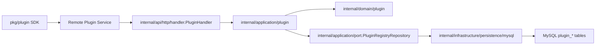
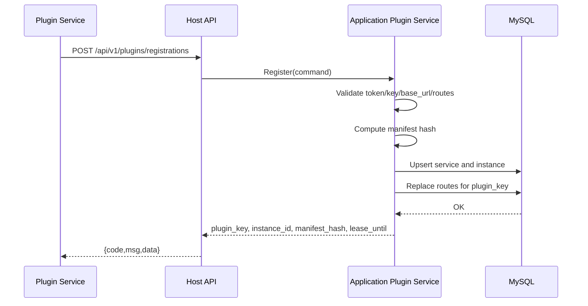
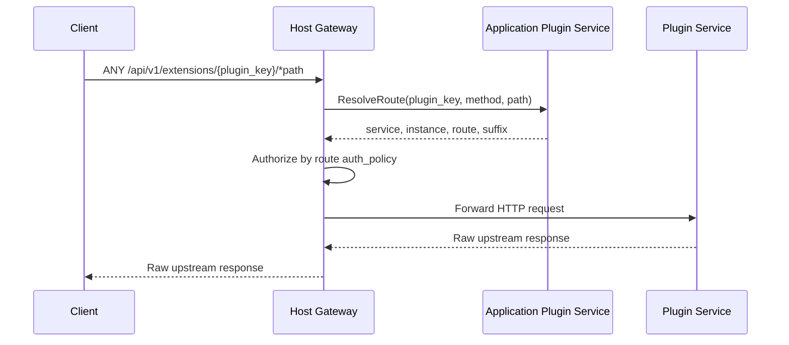

# 远端插件系统设计

本文档描述 Keiyaku-Go 远端服务插件系统的架构、边界、数据模型、网关规则和安全约束。设计裁决来源是 [ADR 20260519：采用远端服务插件系统](../adr/20260519-adopt-remote-service-plugin-system.md)。

## 设计目标

- 插件作为独立服务部署在独立服务器，不加载进主服务进程。
- 主服务统一提供注册、心跳、路由解析、鉴权上下文和 HTTP 网关。
- 首版实际支持 HTTP 插件协议，保留 `protocol` 扩展点，非 HTTP 注册直接拒绝。
- 插件注册表持久化到 MySQL，主服务重启后仍可查询插件状态。
- 保持 Clean Architecture 分层，不引入运行时反射型 DI 容器。

## 非目标

- 不支持 Go dynamic plugin。
- 不提供第三方不可信插件市场、代码沙箱或插件权限隔离运行时。
- 首版不支持 gRPC、WebSocket、SSE、事件订阅、异步消息插件。
- 首版不做同一 `plugin_key` 下的多版本灰度路由。

## 核心对象

| 对象 | 表 | 职责 |
| --- | --- | --- |
| 插件服务 | `plugin_services` | 插件身份、名称、协议、当前 manifest hash、管理状态 |
| 插件实例 | `plugin_instances` | 某台插件服务器的运行实例、base URL、版本、心跳租约 |
| 插件路由 | `plugin_routes` | 主服务扩展路径到插件 upstream 路径的映射 |

同一 `plugin_key` 首版只允许一个 active manifest hash。新 manifest 注册成功后，主服务原子替换该插件的路由，并把旧 hash 实例标记为不兼容或不可路由。

## 模块边界



- `pkg/plugin` 只承载插件侧 SDK 和 manifest 类型，不得 import `internal`。
- `internal/domain/plugin` 承载状态、路由匹配和租约等领域概念。
- `internal/application/plugin` 承载注册、心跳、注销、路由解析、安全校验和状态转换。
- `internal/api/http` 承载 Gin DTO、注册 Handler、管理 Handler 和 HTTP 网关。
- `internal/infrastructure/persistence/mysql` 承载 GORM Model 与 Repository 实现。
- `internal/bootstrap` 显式装配插件依赖，不引入容器或服务定位器。

## 注册流程



注册入口使用静态 Bearer token。token 只能证明调用方具备注册权限，插件身份还必须通过 `allowed_plugin_keys` 白名单约束。

## 心跳与租约

- 插件实例通过 `POST /api/v1/plugins/{plugin_key}/instances/{instance_id}/heartbeat` 刷新租约。
- 主服务保存 `last_seen_at` 和 `lease_expires_at`。
- 路由解析只选择 `status=active` 且 `lease_expires_at >= now` 的实例。
- 注销接口只禁用实例，不删除历史服务记录。

## 网关流程



插件上游业务响应原样透传。主服务只在自身发现错误时返回统一响应，例如路由不存在、插件不可用、上游连接失败或超时。

## 路由匹配

匹配顺序：

1. `plugin_key`
2. active route
3. HTTP method 精确匹配优先于 `ANY`
4. `exact` 优先于 `prefix`
5. 最长 path 优先

`prefix` 必须按路径段匹配，`/foo` 不匹配 `/foobar`。路由只允许挂在 `/api/v1/extensions/{plugin_key}` 下，插件不能覆盖主服务内置路径。

## 鉴权策略

| `auth_policy` | 行为 |
| --- | --- |
| `inherit` | 默认等同已认证用户 |
| `authenticated` | 必须携带有效用户 JWT |
| `rbac` | 使用真实请求路径与 method 走 Casbin 校验 |
| `admin` | 用户角色必须包含 `admin` |
| `public` | 仅当 `plugins.allow_public_routes=true` 时允许匿名访问 |

网关默认不透传原始 `Authorization`。只有 route 显式 `forward_auth_header=true` 时才透传。

## 请求转发

主服务转发以下上下文：

- `X-Trace-ID`
- `X-Keiyaku-Plugin-Key`
- `X-Keiyaku-User-ID`
- `X-Keiyaku-Username`
- `X-Keiyaku-User-Roles`
- `X-Forwarded-Host`
- `X-Forwarded-Proto`
- `X-Forwarded-Method`

主服务会移除 hop-by-hop headers、`Cookie`，默认移除 `Authorization`。

如果配置了 `plugins.gateway_signing_secret`，主服务会追加：

- `X-Keiyaku-Timestamp`
- `X-Keiyaku-Signature`

插件服务可用相同 secret 验证请求确实来自主服务。

## 安全边界

- `plugins.registration_tokens` 生产环境必填，每个 token 至少 32 字节。
- `plugins.allowed_plugin_keys` 默认必填，未列入白名单的插件不能注册。
- `base_url` 只允许 `http` 或 `https`。
- `base_url` 不允许 userinfo、query、fragment。
- host 必须命中 `allowed_hosts` 或 `allowed_cidrs`。
- 默认拒绝 loopback、link-local、metadata IP；本地开发可显式开启 `allow_loopback`。
- 日志不得输出 token、Authorization、Cookie、请求体或完整响应体。

## 配置项

```yaml
plugins:
  enabled: true
  registration_tokens: []
  allowed_plugin_keys: []
  public_prefix: "/api/v1/extensions"
  heartbeat_ttl: 30s
  request_timeout: 5s
  allowed_hosts: []
  allowed_cidrs: []
  allow_loopback: false
  allow_public_routes: false
  gateway_signing_secret: ""
```

## 错误映射

| 场景 | HTTP | 应用错误 |
| --- | --- | --- |
| 注册 token 缺失或错误 | 401 | `CodeUnauthorized` |
| plugin key 未授权 | 403 | `CodeForbidden` |
| manifest/base_url/route 非法 | 400 | `CodeInvalidArgument` |
| 路由不存在 | 404 | `CodeNotFound` |
| 无可用实例或插件禁用 | 503 | `CodeServiceUnavailable` |
| 上游连接失败 | 502 | `CodeBadGateway` |
| 上游超时 | 504 | `CodeGatewayTimeout` |

## 运维与回滚

- 关闭 `plugins.enabled` 可停止注册和网关，不影响主业务接口。
- 表结构保留插件历史状态，回滚时不需要删除插件注册记录。
- 修改 token、白名单、host/CIDR 时无需重启插件服务，但主服务需按配置加载策略重新启动或热更新。
- 插件服务下线前应调用注销接口；异常退出时依靠租约过期自动摘除。

## 后续扩展点

- per-plugin secret 或 HMAC 注册身份。
- mTLS。
- gRPC 插件协议。
- 事件订阅与异步插件。
- 路由缓存与跨主服务实例的负载状态同步。
- 同一 `plugin_key` 下的版本灰度路由。
