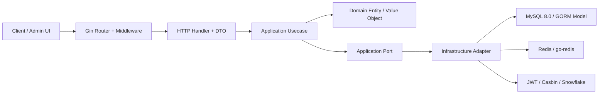
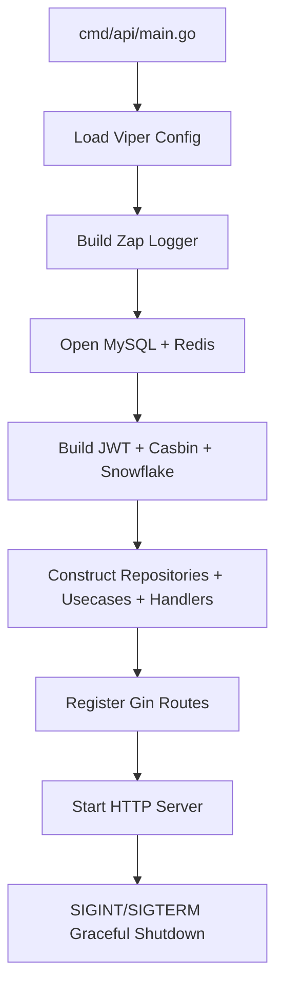

# 系统结构设计

## 分层结构

依赖方向固定为 `api -> application -> domain`。`infrastructure` 只能实现 `application` 或 `domain` 暴露的 Port，不允许把 Gin DTO、GORM Model、Redis、JWT 或 Casbin 类型传入 Domain。

## 请求链路

1. 请求进入 Gin HTTP Server。
2. 中间件处理 TraceID、Recovery、结构化访问日志、CORS、限流、熔断、JWT 与 Casbin。
3. Handler 绑定并校验 DTO，把 DTO 显式转换为 Application Command 或 Query。
4. Application 编排业务用例、事务边界、Repository Port、Cache Port、Token Port 与 IDGenerator Port。
5. Domain 执行业务不变量校验，不依赖任何外部框架。
6. Infrastructure 通过 GORM/Redis/Casbin/JWT/Snowflake 完成具体适配。
7. Handler 把应用结果映射为统一 `{code,msg,data}` JSON。

## 启动链路

`cmd/api/main.go` 只负责进程生命周期。依赖装配集中在 `internal/bootstrap`，并通过显式构造函数自下而上创建。
