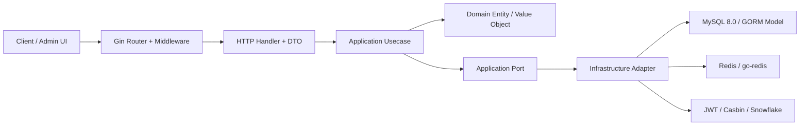
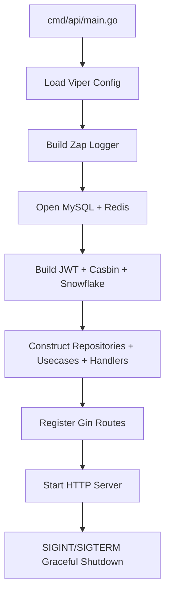
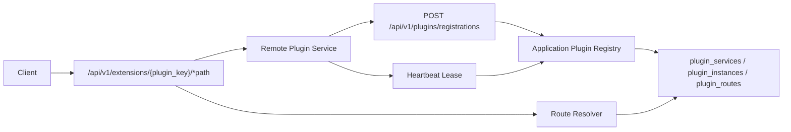

# 系统结构设计

## 分层结构

依赖方向固定为 `domain <- application <- api/infrastructure`。`api` 只通过 Application Service 和 Port 进入业务内核，不直接依赖具体 Infrastructure 或 Repository adapter；`infrastructure` 只能实现 `application` 或 `domain` 暴露的 Port，不允许把 Gin DTO、GORM Model、Redis、JWT 或 Casbin 类型传入 Domain。

HTTP 响应结构、HTTP 状态映射和 Gin context key 属于 `internal/api/http` 外圈。应用错误码、应用错误包装和领域错误映射属于 `internal/application/apperror`，不携带 HTTP 状态语义。项目不再使用根目录 `types` 包承载跨层公共结构。

## 请求链路

1. 请求进入 Gin HTTP Server。
2. 中间件处理 TraceID、Recovery、结构化访问日志、CORS、限流、熔断、JWT 与 Casbin。
3. Handler 绑定并校验 DTO，把 DTO 显式转换为 Application Command 或 Query。
4. Application 编排业务用例、事务边界、Repository Port、Cache Port、Token Port 与 IDGenerator Port。
5. Domain 执行业务不变量校验，不依赖任何外部框架。
6. Infrastructure 通过 GORM/Redis/Casbin/JWT/Snowflake 完成具体适配。
7. Handler 把应用结果映射为统一 `{code,msg,data}` JSON。

## 启动链路

`cmd/api/main.go` 只负责进程生命周期。依赖装配集中在 `internal/bootstrap`，并通过显式构造函数自下而上创建。Bootstrap 负责把 Viper 配置拆成各外圈 adapter 需要的局部配置，例如传给 HTTP Router 的 `router.Options`，Router 不直接依赖 `internal/infrastructure/config.Config`。

## 远端插件链路

插件系统遵循 [ADR 20260519：采用远端服务插件系统](../adr/20260519-adopt-remote-service-plugin-system.md)：

- 插件服务独立部署，主服务只保存插件 manifest、实例租约和路由表。
- `internal/application/plugin` 负责注册、心跳、注销、路由解析和状态转换。
- `internal/api/http/handler.PluginHandler` 负责 HTTP 注册入口、管理查询和网关转发。
- `internal/infrastructure/persistence/mysql` 只实现注册表持久化，不向 Handler 泄露 GORM Model。
- `pkg/plugin` 是插件服务侧 SDK，可被独立插件服务依赖，不得 import `internal`。
- 网关默认只透传 TraceID、插件 key 和脱敏用户上下文；插件业务响应原样返回，主服务只包装自身网关错误。

详细设计见 [远端插件系统设计](plugin-system.md)，插件开发流程见 [插件开发文档](../plugins/development.md)。
